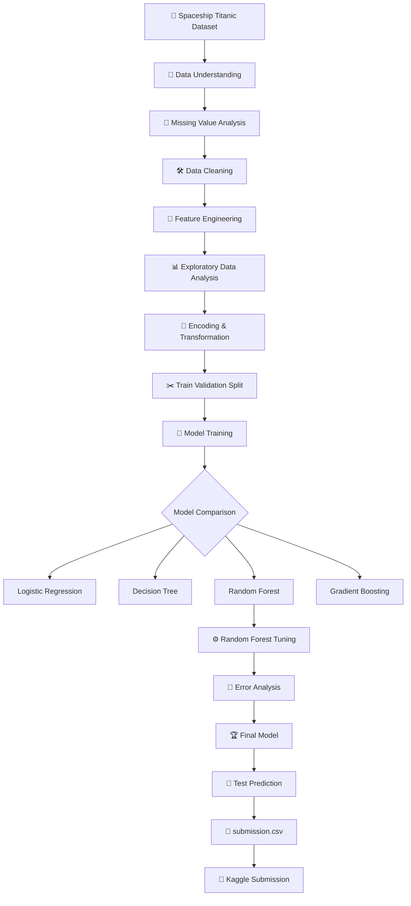

<div align="center">

# 🚀 Spaceship Titanic — ML Classification

### *Predicting whether passengers were transported to an alternate dimension*


<br/>


</div>

---

## 🌌 Project Overview

The **Spaceship Titanic** competition is a binary classification problem based on a fictional space voyage.

The objective is to predict the `Transported` status of each passenger using information such as:

- Home planet
- CryoSleep status
- Destination
- Age
- VIP status
- Cabin information
- Spending across ship amenities
- Passenger travel groups

Instead of jumping directly into model training, this project follows a complete machine-learning workflow:

```text
Raw Dataset
     │
     ▼
Data Understanding
     │
     ▼
Missing-Value Analysis
     │
     ▼
Data Cleaning
     │
     ▼
Feature Engineering
     │
     ▼
EDA & Visualization
     │
     ▼
Encoding & Transformation
     │
     ▼
Train / Validation Split
     │
     ▼
Baseline Model
     │
     ▼
Model Comparison
     │
     ▼
Random Forest Tuning
     │
     ▼
Error Analysis
     │
     ▼
Final Model
     │
     ▼
Test Prediction
     │
     ▼
submission.csv
```

---

## 🎯 Problem Statement

Given passenger-level information from the Spaceship Titanic dataset, predict:

```text
Transported = True / False
```

This is a **binary classification** task.

The competition uses **accuracy** as the evaluation metric:

\[
Accuracy = \frac{Correct\ Predictions}{Total\ Predictions}
\]

Therefore, the project focuses on improving generalization performance on unseen validation/test data rather than simply maximizing training accuracy.

---

## 👥 Team

This project was completed collaboratively by:

| Member | Contribution |
|---|---|
| **Mohit Boura** | Data preprocessing, EDA, feature engineering, model development, validation, error analysis and submission workflow |
| **Tajel Joshi** | Collaborative analysis, experimentation, modeling workflow and competition development |

> 🤝 This project was developed as a two-member Kaggle machine-learning project with a shared focus on understanding the complete ML pipeline rather than only producing a final prediction file.

---

# 🧠 Dataset Understanding

The project starts with the original `train.csv` and `test.csv` files.

The training data contains passenger attributes including:

| Feature | Description |
|---|---|
| `PassengerId` | Unique passenger identifier |
| `HomePlanet` | Passenger's planet of origin |
| `CryoSleep` | Whether the passenger was in cryogenic sleep |
| `Cabin` | Cabin identifier |
| `Destination` | Intended destination |
| `Age` | Passenger age |
| `VIP` | Whether the passenger had VIP service |
| `RoomService` | Room service spending |
| `FoodCourt` | Food court spending |
| `ShoppingMall` | Shopping mall spending |
| `Spa` | Spa spending |
| `VRDeck` | VR deck spending |
| `Name` | Passenger name |
| `Transported` | Target variable in training data |

The notebook performs dataset inspection using:

- `head()`
- `tail()`
- `shape`
- `info()`
- missing-value analysis
- descriptive statistics
- target distribution analysis

---

# 🧹 Data Cleaning

Missing values were treated according to the meaning of each feature rather than applying one blind imputation rule.

### CryoSleep + Spending Relationship

One important domain relationship was used:

```text
CryoSleep = True
        │
        ▼
Passenger is sleeping
        │
        ▼
Amenity spending is expected to be $0
```

The notebook therefore uses the spending features to help infer missing `CryoSleep` values.

The spending columns are:

```python
[
    'RoomService',
    'FoodCourt',
    'ShoppingMall',
    'Spa',
    'VRDeck'
]
```

Other missing values are handled using appropriate statistical/category-based replacements such as median or mode.

---

# 🧩 Feature Engineering

Feature engineering is one of the most important parts of this project.

The raw dataset contains information that is difficult for a machine-learning algorithm to directly interpret. We convert these raw signals into structured numerical features.

## 1. Cabin Decomposition

Original:

```text
Cabin = B/0/P
```

is split into:

```text
Deck = B
Num  = 0
Side = P
```

This allows the model to learn spatial information from the ship.

---

## 2. TotalSpending

Instead of forcing the model to separately interpret five spending columns, a consolidated feature is created:

\[
TotalSpending =
RoomService + FoodCourt + ShoppingMall + Spa + VRDeck
\]

This provides a compact signal about passenger activity.

---

## 3. GroupSize

`PassengerId` contains group information.

For example:

```text
1234_01
1234_02
1234_03
```

indicates passengers belonging to the same group.

The project extracts the group identifier and calculates:

```text
GroupSize
```

This allows the model to capture group/family travel patterns.

---

# 📊 Exploratory Data Analysis

EDA was used to understand how passenger characteristics relate to transportation outcomes.

The notebook includes visual analysis for:

- HomePlanet
- CryoSleep
- Destination
- VIP
- Deck
- Age
- Side
- Transported
- spending distributions
- correlations

---

## 🔥 Major EDA Insights

### CryoSleep

CryoSleep was identified as one of the strongest predictive signals.

The notebook analysis reports approximately:

```text
CryoSleep passengers     → 81.8% transported
Awake passengers         → 32.9% transported
```

This shows a substantial relationship between cryogenic sleep status and the target.

---

### HomePlanet

The analysis found:

```text
Europa → highest transportation rate
Earth  → lowest among the major origins
```

The notebook reports approximately:

```text
Europa → 65.9%
Earth  → 42.4%
```

---

### Deck

Cabin deck also showed strong differences.

Reported transportation rates include approximately:

```text
Deck B → 73.4%
Deck C → 68.0%
Deck E → 35.7%
Deck F → 44.0%
```

This suggests that cabin location contains useful predictive information.

---

### Side

The cabin side also showed a measurable difference:

```text
Starboard (S) → ~55.5%
Port (P)       → ~45.1%
```

The project therefore preserves cabin-side information instead of dropping it.

---

### Spending

Spending variables are highly right-skewed.

A large proportion of passengers have:

```text
TotalSpending = 0
```

while a small number of passengers have extremely high spending values.

To reduce the effect of extreme values, the notebook applies:

```python
np.log1p(x)
```

to spending-related features.

---

# 🔄 Data Transformation

The modeling dataset uses several transformations.

### Binary Encoding

Features such as:

```text
CryoSleep
VIP
Side
Transported
```

are converted to numerical representations.

Example:

```python
Side:
P → 0
S → 1
```

### One-Hot Encoding

Multi-category variables are converted using:

```python
pd.get_dummies(
    ...,
    drop_first=True
)
```

Applied to:

```text
HomePlanet
Destination
Deck
```

This converts categorical information into machine-learning-friendly numerical columns.

---

# ✂️ Train / Validation Split

The processed data is divided into training and validation sets using:

```python
train_test_split(
    X,
    y,
    test_size=0.20,
    random_state=42,
    stratify=y
)
```

### Why `stratify=y`?

The target distribution is preserved across training and validation sets.

Conceptually:

```text
Full Dataset
     │
     ├─────────────── 80% ───────────────┐
     │                                    │
     ▼                                    ▼
 Training Set                         Validation Set
     │                                    │
     ▼                                    ▼
 Model Learning                     Model Evaluation
```

---

# 🤖 Machine Learning Models

Multiple classification algorithms were evaluated.

## Models Tested

1. Logistic Regression
2. Decision Tree
3. Random Forest
4. Gradient Boosting

This makes the project a **model comparison study** rather than relying on one algorithm from the beginning.

---

# 🏆 Model Comparison

Validation results obtained in the project:

| Rank | Model | Validation Accuracy |
|---:|---|---:|
| 🥇 | **Random Forest** | **0.805060** |
| 🥈 | Gradient Boosting | 0.800460 |
| 🥉 | Decision Tree | 0.787809 |
| 4 | Logistic Regression | 0.778608 |

The Random Forest achieved the highest validation accuracy among the tested baseline models.

The notebook records the Random Forest validation accuracy as:

```text
0.8050603795
```

---

# 🌲 Why Random Forest?

Random Forest was selected as the strongest model from the tested baseline models.

It is particularly suitable here because the dataset contains:

- nonlinear relationships
- categorical-derived features
- interactions between passenger characteristics
- spending behavior
- cabin/location signals
- group-related patterns

Random Forest combines many decision trees and aggregates their predictions, which can provide a robust classification model for this type of structured tabular data.

---

# ⚙️ Random Forest Tuning

Several Random Forest configurations were experimented with.

The project explored parameters such as:

```python
n_estimators
max_depth
min_samples_split
min_samples_leaf
```

Example tuning configurations included different values of:

```text
max_depth = 10
max_depth = 15
max_depth = 20

min_samples_split = 2 / 5

min_samples_leaf = 1 / 2
```

This approach was used instead of relying entirely on an expensive large hyperparameter search.

---

# 🔬 Error Analysis

Model evaluation did not stop at accuracy.

The project also investigates model errors using:

### Confusion Matrix

```text
                    Predicted
                 Not       Yes
Actual
Not            TN         FP
Yes            FN         TP
```

The confusion matrix helps identify whether the model is:

- incorrectly transporting safe passengers
- incorrectly predicting passengers as not transported
- performing consistently across both classes

A classification report was also used to inspect:

- Precision
- Recall
- F1-score
- Support

---

# 🔍 Feature Importance

Random Forest feature importance was calculated to identify which variables contributed most strongly to prediction.

Conceptually:

```text
Feature
   │
   ├── CryoSleep
   ├── TotalSpending
   ├── Cabin / Deck signals
   ├── Age
   ├── GroupSize
   └── Other passenger attributes
            │
            ▼
     Model Importance
```

This provides interpretability in addition to simply reporting the final accuracy.

---

# 🧪 Final Modeling Pipeline

The complete project can be summarized as:



---

# 📁 Project Structure

Recommended GitHub repository structure:

```text
spaceship-titanic-ml/
│
├── 📓 kaggel space project_ML.ipynb
├── 📄 train.csv
├── 📄 test.csv
├── 📄 submission.csv
├── 📄 README.md
└── 📄 .gitignore
```

> **Recommendation:** If the repository is public, avoid committing sensitive credentials, API keys, private competition data that is not allowed to be shared, or unnecessary large files.

---

# 📦 Technologies Used

| Technology | Purpose |
|---|---|
| Python | Core programming |
| Pandas | Data manipulation |
| NumPy | Numerical operations |
| Matplotlib | Visualization |
| Seaborn | Statistical visualization |
| Scikit-learn | ML models and evaluation |
| Jupyter Notebook | Experimentation |
| Kaggle | Competition and evaluation |
| GitHub | Version control and project presentation |

---

# 📈 Learning Outcomes

This project was designed not only to build a Kaggle submission but also to understand the complete machine-learning workflow.

### We practiced:

- Data inspection
- Missing-value handling
- Domain-based imputation
- Feature engineering
- Exploratory data analysis
- Categorical encoding
- Numerical transformation
- Train-validation splitting
- Classification
- Model comparison
- Random Forest tuning
- Confusion matrix analysis
- Classification reports
- Feature importance
- Test-set prediction
- Kaggle submission generation

---

# 💡 Key Lessons

### 1. Better features can matter more than a more complicated model

Raw data does not always expose the useful signals.

Features such as:

```text
Deck
Side
Num
TotalSpending
GroupSize
```

make hidden patterns easier for the model to learn.

### 2. Domain knowledge matters

The relationship:

```text
CryoSleep → low/no spending
```

is not just a statistical trick. It comes from understanding what the feature means.

### 3. Model comparison prevents premature conclusions

Instead of assuming one algorithm is best, we evaluated several models and compared validation accuracy.

### 4. Error analysis is part of modeling

A good ML project should answer:

> "Where is my model making mistakes?"

not only:

> "What is my accuracy?"

---

# 🏁 Result

The strongest baseline model in this project was:

## 🌲 Random Forest Classifier

### Validation Accuracy

```text
80.506%
```

This was higher than the tested Logistic Regression, Decision Tree, and Gradient Boosting baselines in the notebook.

The next objective is to continue improving generalization through better feature engineering, more systematic validation, and carefully controlled experimentation.

---

# 🚀 Future Improvements

Potential next steps:

- Cross-validation with controlled runtime
- More systematic Random Forest tuning
- XGBoost / LightGBM / CatBoost comparison
- Better group-level features
- Family/group transport patterns
- Cabin-level interaction features
- More robust imputation pipelines
- Probability calibration
- Ensemble / voting methods
- Feature-selection experiments
- Repeated validation with multiple random seeds

The focus should remain on **reliable validation improvements**, not simply increasing model complexity.

---

# 📚 Project Philosophy

> **Clean data → meaningful features → strong validation → controlled experimentation → reliable prediction.**

This project demonstrates that machine learning is not just about choosing an algorithm.

It is a complete process:

```text
Understand
   ↓
Clean
   ↓
Explore
   ↓
Engineer
   ↓
Model
   ↓
Evaluate
   ↓
Analyze
   ↓
Improve
   ↓
Predict
```

---

<div align="center">

### 🚀 Built with Python • Scikit-learn • Pandas • Jupyter • Kaggle

**Mohit Boura × Tajel Joshi**

⭐ If you found this project useful, consider giving the repository a star!

</div>
